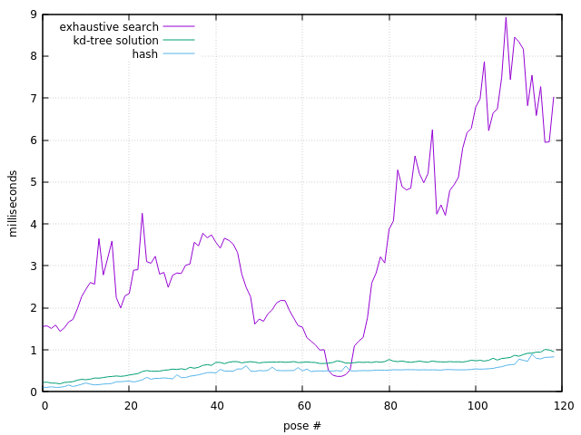

# Visual-odometry

This project consists in estimating the pose of a robot that is moving, based on world features it sees.

In this branch, the pose of the robot is estimated in $SE(2)$ and the approach is the following
- estimate the pose between the first pair of measurements using epipolar geometry
- given this pose and the measurements, triangulate to have a set of world points
- perform projective icp (picp) iteratively between subsequent poses. At each pose, we update the world map with the previously triangulated points, and use the whole map in picp

Data association is done in the same way as in the main branch. At the end of this README, a performance comparison between data association approaches is presented

The estimation of the pose is done in $SE(2)$ by considering the state still to be a $SE(3)$ pose, but the perturbation $\Delta x$ is 3 dimensional. Hence, only planar poses are estimated.

## Build

Same as main branch.

## Run

Same as main branch.

## Visualization

To compare estimated and true trajectory, write in the terminal
```
gnuplot
gnuplot>splot "trajectory_gt.txt" u 1:2:3 w p,"trajectory_est_complete.txt" u 1:2:3 w p
```
<p align="center">

</p>

The estimated trajectory in the plot shown above has an error on the z-axis of the order of $10^{-5}$, much less than the estimate done on the main branch where the error reached almost 0.1.


To show the true trajectory, together with the estimated corrected map, the true world points and the correspondences between them, write in the gnuplot shell
```
splot "world_pruned.txt" u 1:2:3 w p ps 0.7 title "true","map_corrected.txt" u 1:2:3 w p ps 0.7 title "corrected","arrows.txt" using 1:2:3:($4-$1):($5-$2):($6-$3) with vectors nohead title "correspondences","trajectory_gt.txt" u 1:2:3 w p pt 7 title "gt trajectory"
```

<p align="center">

</p>

The computed RMSE between the true world points and the estimated ones (corrected by the ratio) is $0.208104$.

 To have a graph of the orientation error and the ratio, write in the gnuplot shell
```
plot "out_performance.txt" u 1 w l title "orientation","out_performance.txt" u 2 w l title "ratio"
```
<p align="center">

</p>

The orientation error is of the order of $10^{-6}$, and the points where the ratio is not plotted is when the robot stops moving, hence the norm of the ground truth translation is 0.

## Data association

Here are presented 3 methods to perform data association between points in the world we are creating, and the measurements we have at a given pose
- The first one is exhaustive search: compare the appearances of every measurement with the appearance of every point in the world
- Another approach is to use a [map](https://en.cppreference.com/w/cpp/container/unordered_map) with key-value pairs being appearance-id of the point. This is regarded as "hash" in the legend of the plot
- Lastly, we have the approach with the kd tree of 11 dimensional points

Clearly, the approach with hash is the fastest and the exhaustive search is the slowest. However, the first approach has the huge flaw of hashing floats: namely, we will get a match only if the 10D vector of floats - that represent the appearance - match exactly. 

Conversely, the approach with the kd tree is slightly slower, but it's possible to choose a ball radius in the appearance space where to search for a match. In this project the search done in the kd-tree is always a full search.

<p align="center">

</p>
