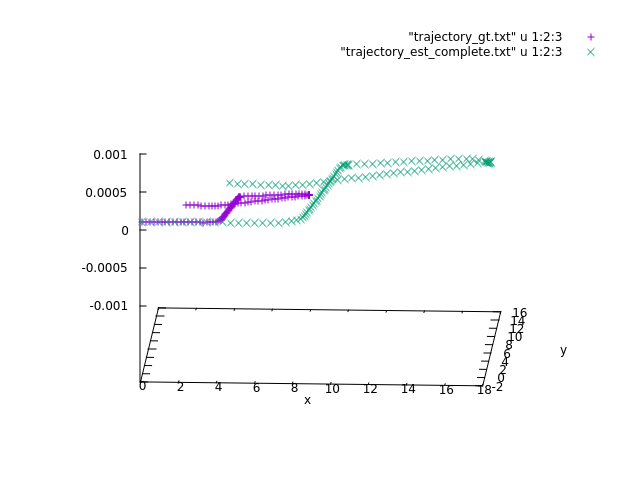
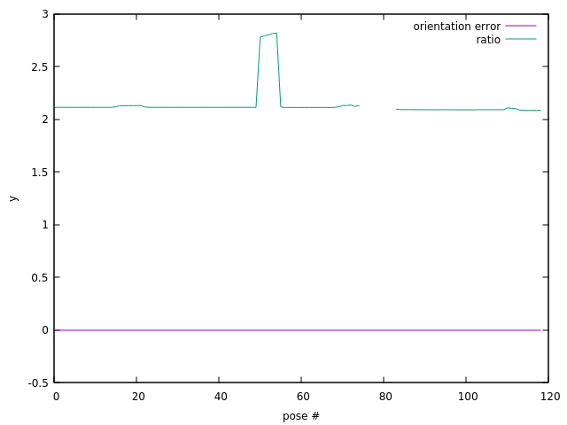

# Visual-odometry
On this branch, the estimation of the pose of the robot is done in $SE(2)$ and the whole map is built and used during picp, unlike the main branch.

To build this project:
- create build directory with `mkdir build` and navigate to it with `cd build`
- then do `cmake ..` and `make`

A folder `exec/` will be created inside the build folders, with the following executables:
- `init`: syntethic data and measurements are generated, and the pose between two images is estimated using epipolar geometry
- `picp_test`: synthetic data and measurements from 2 poses are generated, the relative pose is estimated using picp
- `whole_test`: synthetic data and 3 sets of measurements are generated: estimation of the relative pose between the first two cameras is done using epipolar geometry. Given this transformation, we triangulate to estimate the position of the points in the world, and then use this estimate to perform picp
- `read_data_test`: a test to see if the measurement files are retrieved correctly
- `real_init`: the relative position between the first 2 set of real measurements is estimated using epipolar geometry
- `picp_known_real`: picp is performed on the given data, assuming that the position of the points in the world is known and also data association in known
- `vo_daKnown`: the relative position between the first 2 set of measurements is estimated using epipolar geometry, then triangulation is performed to find a set of world points, and then iteratively picp is executed between subsequent poses, each time triangulating to find a new set of world points. Data association is given
- `vo_complete`: same as before, but data association is not given. Correspondances are retrieved using a kd tree leveraging on the appearances of the points
- `evaluation`: comparison between ground truth and predicted trajectory previously saved. Given two estimated absolute poses $T_0,T_1$ and the corresponding ground truth poses $T_{0,GT},T_{1,GT}$ represented as homogenous matrices $\in \mathbb{R}^{4\times4}$, we can compute the relative poses as
```math
\textbf{T}_{rel}=\textbf{T}^{-1}_{0}\textbf{T}_1
```
```math
\textbf{T}_{rel,GT}=\textbf{T}^{-1}_{0,GT}\textbf{T}_{1,GT}
```
and then the orientation error $e_{\theta}$ and position ratio $r_t$ are computed as
```math
e_{\theta}=trace(\textbf{I}_{3}-\textbf{T}_{err}(1:3,1:3))
```
```math
r_t=\frac{||\textbf{T}_{rel}(1:3,4)||}{||\textbf{T}_{rel,GT}(1:3,4)||}
```
where matlab-like indexing is used. These last two quantities are used for evaluation.

## What to run
After having built the project as stated above, run the created executable ```vo_complete``` that will generate the following files
- ```world.txt``` containing all the true world points, one on each line
- ```trajectory_gt.txt``` containing on each line the true position of the robot in the form $[t_x \ t_y \ t_z]$, expressed in the world frame
- ```map.txt``` containing all the estimated world points, one on each line
- ```map_appearances.txt``` containing on line $i$ the appearance of the point in ```map.txt``` on line $i$
- ```trajectory_est_complete.txt```containing on each line the estimated position of the robot in the form $[t_x \ t_y \ t_z]$, expressed in the world frame
- ```trajectory_est_data.txt``` that contains the estimated pose of the robot expressed in the world frame. Pose $i$ is written on this file with one line for $[t_{x_i} \ t_{y_i} \ t_{z_i}]$, and the next three lines contain the rotation matrix $\textbf{R}_i$ written in row major order

Then, run the executable ```evaluation``` that will read from the ground truth trajectory file ```trajectory.dat```,```world.dat``` (not the ones created before), and from some of the newly created files, will print in the terminal the RMS between the estimated and true points and will generate
- ```out_performance.txt``` where on line $i$ we have the orientation error and translation ratio for pose $i$ as detailed above
- ```map_corected.txt``` containing the same points as ```map.txt``` but scaled by the found translation ratio
- ```world_pruned.txt``` that contains the true position of the world points that are in map
- ```arrows.txt``` that on each line has the coordinate of the estimated world point and the corresponding true coordinates
## Visualization
The generated ```*.txt``` files are meant to be used with gnuplot as follows

To compare estimated and true trajectory, write in the terminal
```
gnuplot
gnuplot>splot "trajectory_gt.txt" u 1:2:3 w p,"trajectory_est_complete.txt" u 1:2:3 w p
```
<p align="center">

</p>

The estimated trajectory in the plot shown above has an error on the z-axis of the order of $10^{-5}$, much less than the estimate done on the main branch where the error reached 0.1.


To show the true trajectory, together with the estimated map, the true world points and the correspondences between them, write in the gnuplot shell
```
splot "world_pruned.txt" u 1:2:3 w p ps 0.7 title "true","map_corrected.txt" u 1:2:3 w p ps 0.7 title "corrected","arrows.txt" using 1:2:3:($4-$1):($5-$2):($6-$3) with vectors nohead title "correspondences","trajectory_gt.txt" u 1:2:3 w p pt 7 title "gt trajectory"
```

<p align="center">

</p>

The computed RMSE between the true world points and the estimated ones (corrected by the ratio) is $0.208104$.

 To have a graph of the orientation error and the ratio, write in the gnuplot shell
```
plot "out_performance.txt" u 1 w l title "orientation","out_performance.txt" u 2 w l title "ratio"
```
<p align="center">

</p>
